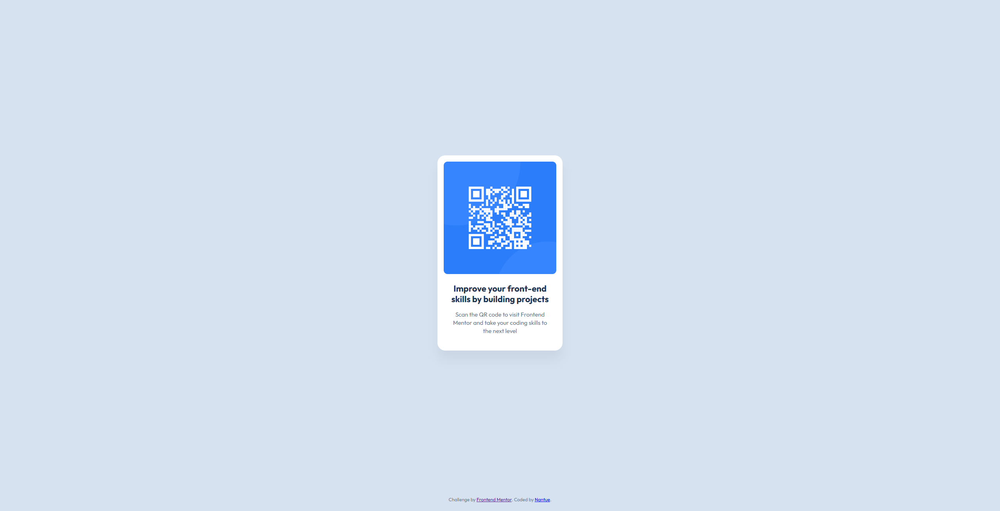

# QR Code Component

This is my solution for the QR Code Component challenge from Frontend Mentor.

## Screenshot



## Links

- Solution URL: https://github.com/TU-USUARIO/qr-code-component
- Live Site URL: https://TU-USUARIO.github.io/qr-code-component/

## Built with

- Semantic HTML5
- CSS custom properties
- CSS Grid
- Responsive layout
- Mobile-first workflow

## What I learned

In this project, I practiced how to center a card on the screen using CSS Grid.

I also learned how to make a component responsive without using media queries, using:

```css
.card {
  width: 100%;
  max-width: 320px;
}